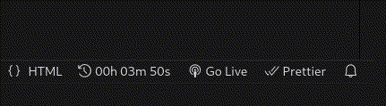

# Tick Tock – Simple Time Tracker for Visual Studio Code

**Tick Tock** is a lightweight time tracking extension that helps you measure productivity by automatically recording time spent in each workspace. Know exactly how much time your projects require.

## Features

✅ **Workspace-Specific Tracking** – Independent timers for each VSCode workspace  
✅ **Lightweight Operation** – Runs efficiently without impacting performance  
✅ **Minimalist Interface** – Clean implementation with zero configuration

### How It Works

Automatic time tracking starts when you open a workspace:

- **Status bar timer** shows elapsed time
- **Single-click control** – pause/resume directly from the status bar

All commands are also available via Command Palette (<kbd>Ctrl</kbd>/<kbd>Cmd</kbd> + <kbd>Shift</kbd> + <kbd>P</kbd>):

| Command                    | Action                               |
| -------------------------- | ------------------------------------ |
| `Tick Tock: Resume timer` | Resumes paused tracking              |
| `Tick Tock: Pause timer`  | Temporarily stops time recording     |
| `Tick Tock: Reset timer`  | Clears current timer |

> ⚠️ **Note:** Timer reset cannot be undone.

## Extension Settings

_Currently no configurable settings – designed to work out-of-the-box._

## Release Notes

### 0.0.1

Initial release featuring:

- Automatic workspace time tracking
- Status bar controls
- Basic command palette integration
